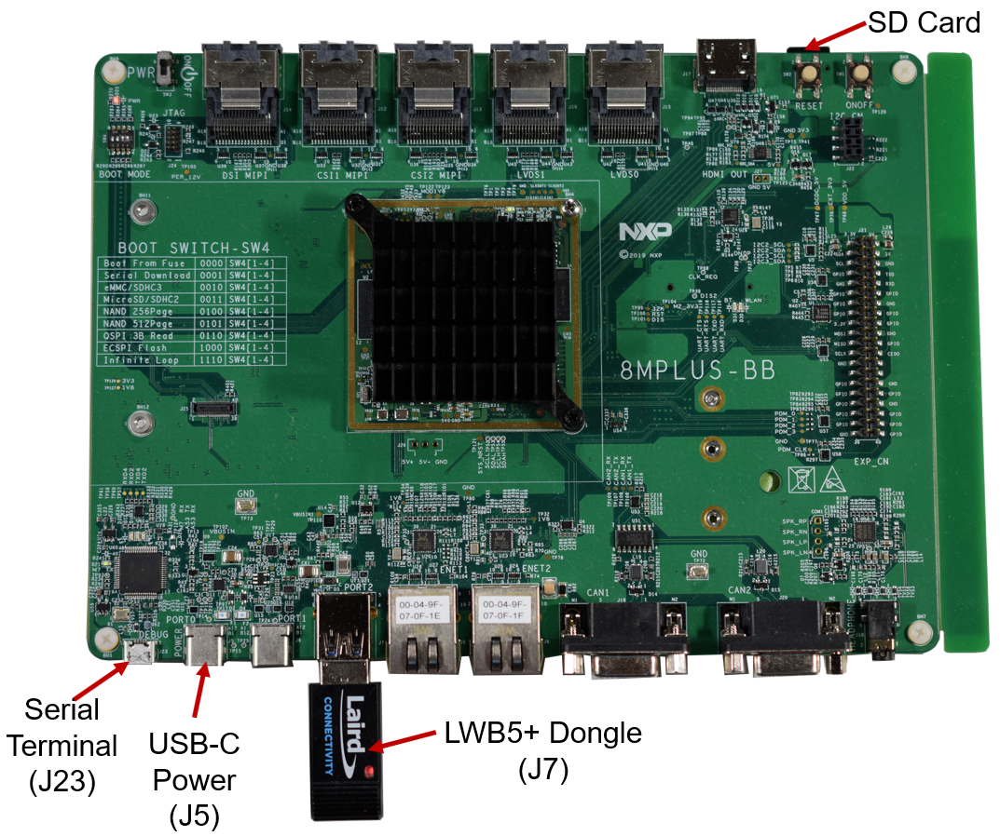

# LWB5+ Dongle i.MX 8M Plus Yocto Integration


 This tutorial will show you how to integrate the LWB5+ Dongle into an i.MX 8M Plus Yocto platform.

1. Required Tools

   - LWB5+ Dongle (Part No. 450-00127 )
   - i.MX 8M Plus EVK (Part No. 8MPLUSLPD4-EVK)
   - Linux PC with a Yocto Build Environment. As a prerequisite for this, we are going to assume that you know how to setup a Yocto build environment. This is covered on NXP's documentation ( i.e. see *i.MX_Yocto_Project_User's_Guide.pdf Rev. L5.4.70_2.3.0 — 31 December 2020* for details on how to install the required *host packages* and the *repo utility* and how to setup *git*); so we will not cover it here. We will focus on how to add Laird Connectivity's external layer into a Yocto build. 

2. Setup

   We will flash our image into a micro SD card. If you prefer, you can use the onboard eMMC instead of an SD card. The LWB5+ Dongle will plug into J7. Power will be applied via J5, and J23 will be used to connect to a serial terminal (115200, N, 8, 1) . If the build works, the drivers will automatically load on power up. We will then connect to an AP and do a ping to demonstrate that WiFi works. For Bluetooth, we will do a scan to show that the module can detect devices that are discoverable or advertising.

   

   

3. Setup build environment

   ```
   mkdir ~/projects/lwb5p-imx8mp
   cd ~/projects/lwb5p-imx8mp
   repo init -u https://source.codeaurora.org/external/imx/imx-manifest -b imx-linux-zeus -m imx-5.4.70-2.3.0.xml && repo sync 
   DISTRO=fsl-imx-wayland MACHINE=imx8pevk source imx-setup-release.sh -b build-imx8p-wayland 
   ```

   

4. Re-source your build environment. NOTE: For this tutorial, our project folder will be in *~/projects/lwb5p-imx8p* and the build directory is *build-imx8p-wayland*.

   ```
   cd ~/projects/lwb5p-imx8mp
   source setup-environment build-imx8mp-wayland 
   ```

   

5. Modify local.conf file

6. Modify bblayers.comf 

7. Clone meta laird cp

8. Modify the bb iagem

9. Modify menuconfig

10. build the project

11. create SD card

12. Boot device

13. Test WiFi

14. Test Bluetooth

15. 