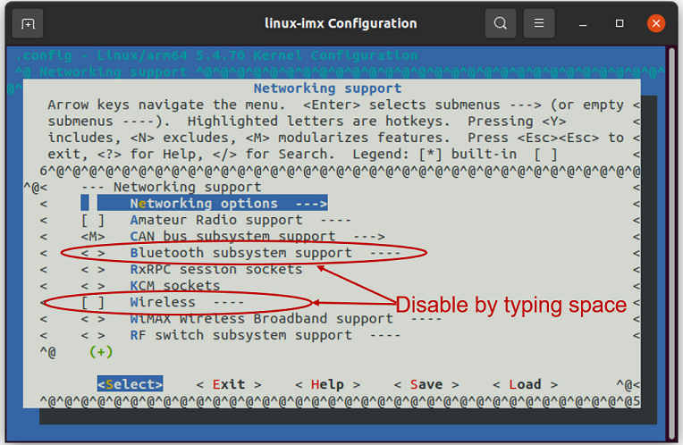

# LWB5+ Dongle i.MX 8M Plus Yocto Integration


 This tutorial will show you how to integrate the LWB5+ Dongle on an i.MX 8M Plus Yocto platform.

1. Required Tools

   - LWB5+ Dongle (Part No. 450-00127 )
   - i.MX 8M Plus EVK (Part No. 8MPLUSLPD4-EVK)
   - Linux PC with a Yocto Build Environment. As a prerequisite for this tutorial, we are going to assume that you know how to setup a Yocto build environment. This is covered very well in NXP's documentation ( i.e. see *i.MX_Yocto_Project_User's_Guide.pdf, Rev. L5.4.70_2.3.0 — 31 December 2020* for details on how to install the required *host packages* and the *repo utility*, and how to setup *git*); so we will not cover it here. We will focus on how to add Laird Connectivity's external layer into a Yocto build. 

2. Setup

   We will flash our image into a micro SD card. If you prefer, you can use the onboard eMMC instead of an SD card, but for this tutorial we'll use an SD card. The LWB5+ Dongle will plug into J7. Power will be applied via J5, and J23 will be used to connect to a serial terminal (115200, N, 8, 1). If the build works, the drivers will automatically load on power up. We will then connect to an AP and do a ping to demonstrate that WiFi works. For Bluetooth, we will do a scan to show that the module can detect devices that are discoverable or advertising.

   

   

3. Download the i.MX Yocto Project Community BSP recipe layers

   **Reminder:** Prior to proceeding, make sure the required host packages and repo utility are installed. Git must also be configured properly. Refer to *i.MX_Yocto_Project_User's_Guide.pdf, Rev. L5.4.70_2.3.0 — 31 December 2020* for details.

   ```
   mkdir ~/projects/imx8mp
   cd ~/projects/imx8mp
   repo init -u https://source.codeaurora.org/external/imx/imx-manifest -b imx-linux-zeus -m imx-5.4.70-2.3.3.xml && repo sync 
   ```

   

4. Setup build configuration

   ```
   DISTRO=fsl-imx-wayland MACHINE=imx8mpevk source imx-setup-release.sh -b build-imx8p-wayland 
   ```

   

5. Modify the ~/projects/imx8mp/build-imx8p-wayland/conf/bblayers.conf file. Add the line below to the file.

   ```
   BBLAYERS += "${BSPDIR}/sources/meta-laird-cp" 
   ```

   

6. Modify the  ~/projects/imx8mp/build-imx8p-wayland/conf/local.conf file.  Add the lines below to the file.

   ```
   PREFERRED_PROVIDER_wpa-supplicant = "sterling-supplicant" 
   PREFERRED_PROVIDER_wpa-supplicant-cli = "sterling-supplicant" 
   PREFERRED_PROVIDER_wpa-supplicant-passphrase = "sterling-supplicant" 
   
   BBMASK += " \ 
       meta-laird-cp/recipes-packages/openssl \ 
       meta-laird-cp/recipes-packages/.*/.*openssl10.* \ 
       "
   
   PREFERRED_RPROVIDER_wireless-regdb-static = "wireless-regdb" 
   LWB_REGDOMAIN = "US" 
   ```

   

7. Clone the meta-laird-cp layer into ~/projects/imx8mp/sources directory

   ```
   cd ~/projects/imx8mp/sources
   git clone https://github.com/LairdCP/meta-laird-cp
   ```

   

8. Edit the ~/projects/imx8mp/sources/meta-laird-cp/recipes-packages/images/sample-image-cp-lwb5plus.bb recipe by replacing *lwb5plus-sdio-div-firmware* with *lwb5plus-usb-sa-firmware* and adding *laird-networkmanager*. Then save it as mylwb5p.bb. A snippet of the saved file is shown below.

   ```
   IMAGE_INSTALL += "\ 
   iproute2 \ 
   rng-tools \ 
   ca-certificates \ 
   tzdata \ 
   alsa-utils \ 
   htop \ 
   ethtool \ 
   iperf3 \ 
   tcpdump \ 
   iw \ 
   kernel-module-lwb5p-backports-laird \ 
   lwb5plus-usb-sa-firmware \ 
   sterling-supplicant-lwb \ 
   laird-networkmanager \ 
   " 
   ```

   


9. Next go into the build directory edit the kernel

   ```
   cd ../build-imx8p-wayland 
   bitbake -c menuconfig virtual/kernel
   
   ```

   - Disable Wireless LAN drivers. Navigate to *Device Drivers* -> *Network device support* and disable *Wireless LAN* .

     

     

     

   - Disable Bluetooth subsystem support and Wireless. Navigate to *Networking support* and disable *Bluetooth subsystem* *support* and *Wireless*.

     

     

     

10. Build the image

    ```
    bitbake mylwb5p
    ```

    

11. Flash image into SD card. Note for this particular tutorial the SD card is on /dev/mmcblk0. It may be different for your setup; so make sure you change the command below per your setup.

    ```
    bzip2 -dc ~/projects/imx8mp/build-imx8p-wayland/tmp/deploy/images/imx8mpevk/mylwb5p-imx8mpevk.wic.bz2 | sudo dd bs=512K iflag=fullblock oflag=direct status=progress conv=fsync of=/dev/mmcblk0
    
    sync
    ```

    

12. Connect EVK to Serial Terminal via J23 (115200, N, 8, 1). Boot device and login as root

    

13. Test WiFi. Create a connection profile with nmcli. Then connect to the AP and ping a website.

    ```
    nmcli con add con-name "YourProfile" ifname wlan0 type wifi ssid "YourAP" wifi-sec.key-mgmt wpa-psk wifi-sec.psk "YourPassword" 
    nmcli c u "YourProfile" 
    ping www.lairdconnect.com
    ```

    

14. Test Bluetooth. Launch *bluetoothctl*. Then on the *bluetoothctl* prompt, type *power on* and then *scan on*.

    

    

    